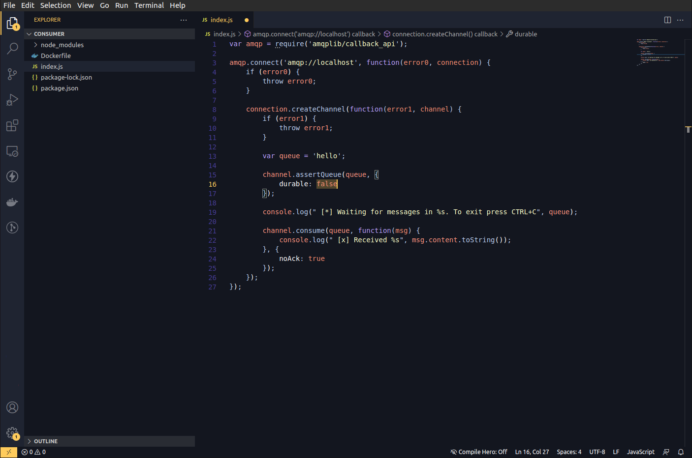

# Este es un tema de Código Vikingo
Código Vikingo es la comunidad de programación más furiosa!

Discord: [Código Vikingo Server](https://discord.gg/dGHN2KufWm)
Instagram: [@vikingcodeblog](https://www.instagram.com/vikingcodeblog/)

Todos nuestros enlaces -> [https://codigovikingo.es/links/links.html](https://codigovikingo.es/links/links.html)


# ScreenShots

## Default

## Classic


## Classic Dark


# Install proyect
## Clone
```
git clone https://github.com/VikingCodeBlog/Mj-lnir.git
```
## Install vsce
npm install -g vsce

# Publish your own versionç
You need an Azure DevOps account.

```
vsce package
```
```
vsce publish
```
